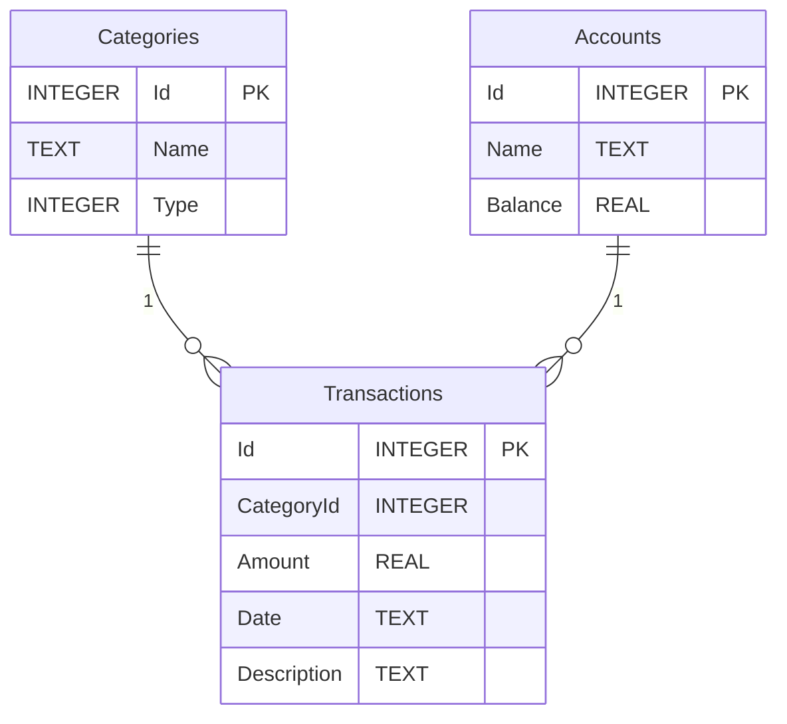

```mermaid
erDiagram
    Categories {
        INTEGER Id PK
        TEXT Name 
        INTEGER Type
    }
    Transactions {
        Id INTEGER PK
        CategoryId INTEGER
        Amount REAL
        Date TEXT
        Description TEXT
    }
    Accounts {
        Id INTEGER PK
        Name TEXT
        Balance REAL
    }
    Categories || --o{ Transactions : "1"
    Accounts || --o{ Transactions : "1" 
    
```