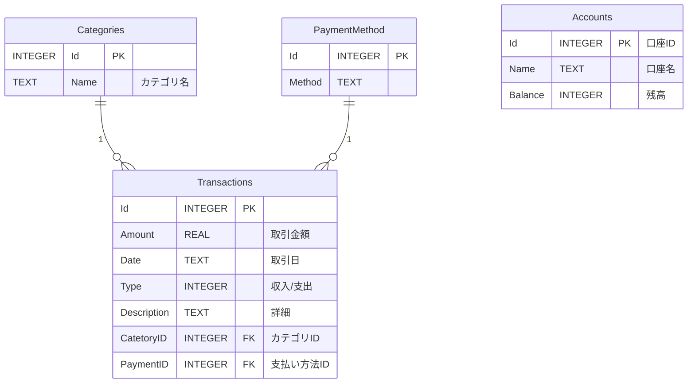

```mermaid
erDiagram
    Categories {
        INTEGER Id PK
        TEXT Name "カテゴリ名"
    }
    Transactions {
        Id INTEGER PK
        Amount REAL "取引金額"
        Date TEXT "取引日"
        Type INTEGER "収入/支出"
        Description TEXT "詳細"
        CatetoryID INTEGER FK "カテゴリID"
        PaymentID INTEGER FK "支払い方法ID"

    }
    
    PaymentMethod{
        Id INTEGER PK
        Method TEXT
    }
    Accounts {
        Id INTEGER PK "口座ID"
        Name TEXT "口座名"
        Balance INTEGER "残高"
    }
    Categories || --o{ Transactions : "1"
    PaymentMethod || --o{ Transactions:"1"
    
```